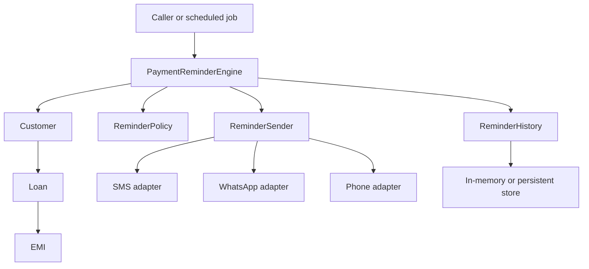
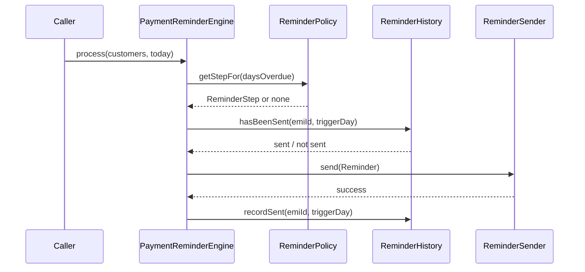
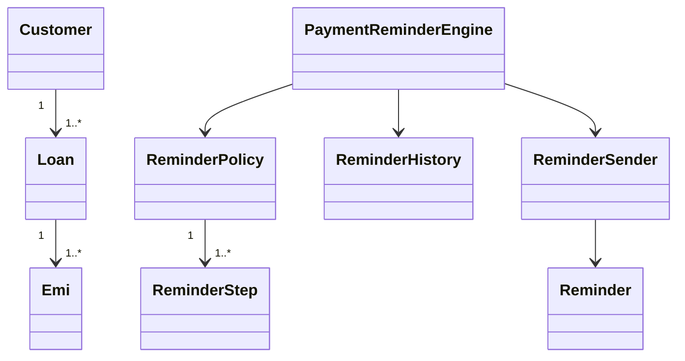

# LLD Round: Payment Reminder Engine

A simple Java implementation of an interview problem: identify overdue loan EMIs and send customer reminders according to an escalation policy. The design keeps the policy, workflow, delivery, and reminder history separate so requirements can evolve without tying the engine to a specific messaging provider or database.

## Problem Statement

A customer can have one or more loans, and each loan can have multiple EMIs with due dates. When an EMI is overdue, contact the customer according to this schedule:

| Days overdue | Reminder channel |
| ---: | --- |
| 1 | SMS |
| 3 | WhatsApp message |
| 7 | Phone call |

Stop sending reminders for an EMI once its outstanding balance is cleared. The interview is expected to add requirements during the discussion; the design should make those changes local and explainable.

## Requirements

### Functional

- Support customers with multiple loans and loans with multiple EMIs.
- Determine whether an EMI is overdue and calculate its outstanding amount.
- Select the configured reminder channel for the current overdue day.
- Send reminders to the contact associated with that channel.
- Do not send a reminder before its trigger day, after the EMI is settled, or more than once for the same EMI and trigger day.
- Allow delivery and reminder history implementations to be replaced independently.

### Quality Goals

- Keep the escalation schedule configurable rather than embedding channel decisions in the processing loop.
- Make delivery testable without calling a real SMS, WhatsApp, or phone provider.
- Make duplicate prevention explicit at the reminder-history boundary.
- Keep the initial solution small enough to explain and implement in an LLD round.

## Clarifying Questions

These are useful questions to ask before coding. The implementation uses the defaults listed below when the prompt does not specify an answer.

| Question | Current assumption |
| --- | --- |
| Does day 1 mean one calendar day after the due date? | Yes. The due date itself is day 0; the next date is day 1 overdue. |
| Are trigger days exact, or should a missed reminder be sent later? | Exact trigger days. The scheduler is expected to run daily; missed-trigger catch-up is not implemented. |
| Is escalation tracked per customer, loan, or EMI? | Per EMI. Each EMI has independent reminder history. |
| Does any payment stop reminders? | No. Reminders continue while any balance remains; they stop when the EMI is fully settled. |
| What if the customer has no contact for the selected channel? | Skip that reminder and do not record it as sent. |
| Can multiple reminders be sent on the same day? | The schedule has one step per overdue day, and each EMI can produce at most that day's one reminder. |
| How are business days, time zones, quiet hours, and customer consent handled? | Not defined in the initial scope; these need product rules before implementation. |
| What should happen if a provider fails? | Do not mark the reminder as sent; allow a later processing attempt to retry it. |

## Design Overview



The caller supplies customers and the date to evaluate. `PaymentReminderEngine` visits each EMI, asks the policy for the step matching its days overdue, checks reminder history, and sends a `Reminder` through the sender boundary. A successful delivery is recorded only after `send` returns successfully.



These are Java packages in one small application, not separate Maven modules.

## Main Components

| Component | Responsibility |
| --- | --- |
| `Customer` | Customer identity, channel contacts, and loans. SMS and phone calls use the phone number; WhatsApp uses the WhatsApp number. |
| `Loan` | Loan identity and its EMIs. |
| `Emi` | Due date, amount due, payments received, outstanding amount, and settled status. |
| `ReminderPolicy` | Ordered, unique overdue-day steps. The default policy is day 1 SMS, day 3 WhatsApp, and day 7 phone call. |
| `ReminderStep` | One policy rule: an overdue day and its channel. |
| `Reminder` | Delivery payload containing customer, loan, EMI, recipient, channel, due date, overdue days, and outstanding amount. |
| `PaymentReminderEngine` | Application service that evaluates EMIs and coordinates policy, history, and delivery. |
| `ReminderHistory` | Repository abstraction used to check and record sent reminder steps. |
| `InMemoryReminderHistory` | Example in-memory history implementation. Replace it with durable storage for a real service. |
| `ReminderSender` | Delivery boundary. A real implementation can route to SMS, WhatsApp, and phone-call providers. |

## Domain Model



`Emi` tracks `amountDue` and `amountPaid`. Its outstanding amount is `max(amountDue - amountPaid, 0)`, and it is settled once payments cover the amount due. Additional payments are capped at the amount due. The engine only evaluates an EMI while it is unsettled and its due date is before `today`.

## Reminder Processing

For each customer, loan, and EMI, the engine:

1. Skips the EMI if it is settled or not yet overdue.
2. Calculates calendar days overdue as the number of days between the due date and `today`.
3. Looks up an exact-day `ReminderStep` in the policy. If there is no step for that day, it does nothing.
4. Checks history for the `(emiId, daysOverdue)` step. If already sent, it does nothing.
5. Resolves the channel contact. If the contact is missing or blank, it skips delivery.
6. Creates a `Reminder` and calls `ReminderSender.send`.
7. Records the step in history only after delivery succeeds.

If `send` throws an exception, that reminder is not recorded as sent. The exception currently propagates to the caller, so processing stops at that failure; batch-level isolation and retry scheduling are future concerns.

## Idempotency and Persistence

`InMemoryReminderHistory` uses `(emiId, daysOverdue)` as its key. This prevents the same step from being sent again when `process` is called multiple times on the same day, for as long as the process remains alive.

The in-memory implementation is only for demonstrating the boundary. A production repository should persist history and enforce uniqueness atomically, for example with a unique key over `(emiId, triggerDay)`. If EMI IDs are not globally unique, include the loan or customer ID in that key. The durable write and external provider send also need a deliberate consistency strategy, such as an outbox, to handle a process crash between the send and history write.

## Complexity

Let `E` be the number of EMIs visited and `S` the number of configured policy steps. Current policy lookup is linear, so processing is `O(E * S)` time, plus delivery and repository costs. The engine itself uses `O(1)` additional space per EMI; reminder history grows with the number of recorded steps.

## Extending the Design

- **New escalation timing or channel:** add a `ReminderStep` to a `ReminderPolicy`; add provider routing behind `ReminderSender`.
- **Persistent history:** implement `ReminderHistory` with a database and an atomic uniqueness constraint.
- **Missed-trigger catch-up:** define whether to send only the latest missed step, every missed step, or none; then make the policy return eligible unsent steps rather than only an exact-day match.
- **Quiet hours or business calendars:** inject a calendar/time policy into evaluation; specify time-zone and holiday behavior first.
- **Multiple policies or customer segments:** associate a policy with a customer, loan, or product and select it explicitly.
- **Provider retries and rate limits:** add a delivery queue, retry policy, and provider-specific status handling without embedding those concerns in the domain model.

## Run the Example

Requirements: a JDK 8 or later. Maven is not required to compile and run the application; the main code uses only the Java standard library.
### PowerShell

```powershell
$classes = "out"
New-Item -ItemType Directory -Force $classes | Out-Null
$sources = Get-ChildItem src/main/java -Recurse -Filter *.java | ForEach-Object FullName
javac --release 8 -d $classes $sources
java -cp $classes com.paymentremindersystem.PaymentReminderEngine
```

### macOS / Linux

```sh
mkdir -p out
javac --release 8 -d out $(find src/main/java -name '*.java')
java -cp out com.paymentremindersystem.PaymentReminderEngine
```

The demo creates one EMI due yesterday and prints the day-one SMS reminder.